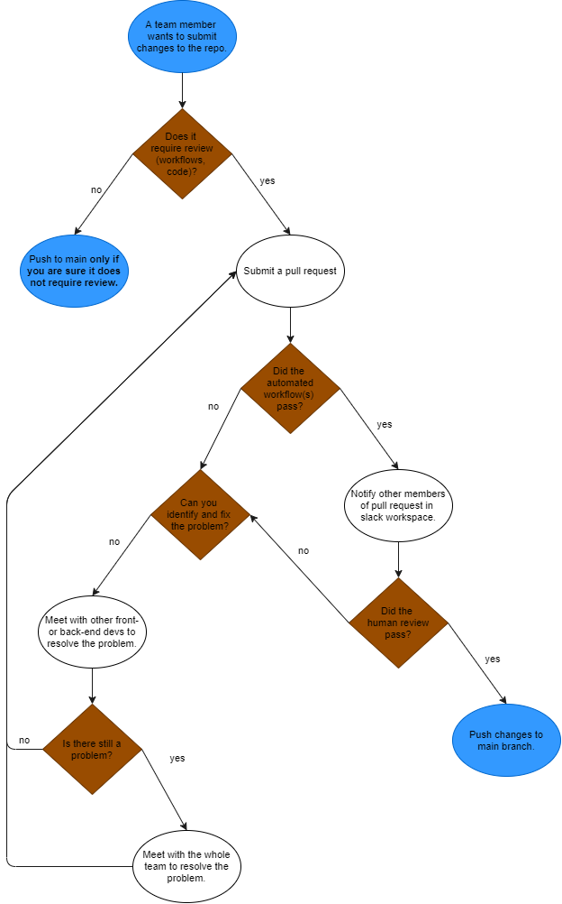

# CI/CD Pipeline
## Current Status
The CI/CD Pipeline consists of a series of checkpoints that ensure our code is functional and well-documented. Github actions will be ran at each push and pull request to ensure that nothing "breaks" the existing project files or introduces syntax errors. Unit tests will be introduced where possible, mainly to test interactions with localStorage. A majority of code/documents will be human-reviewed to ensure that they don't introduce logic errors and follow style guidelines.

As of 05/16/2021 the only implemented workflow is an HTML validator that checks for syntax issues. A spellchecker was brought under consideration but ultimately scrapped as it is inefficient to maintain a wordlist (for variable names and other items that might be flagged as mispelled) when our .md files will discuss specifics about the project; further, running spellchecks at every push and pull request could clog up the Actions tab.

The validator was checked in a separate repository; it correctly identified issues in html files with missing closing tags and reported no issue with simple html files that had been human-reviewed. In this repository it has identified no issues with the project skeleton code (which had been developed in a group coding session and also human-reviewed beforehand).

## Future Plans
In the future we plan to add workflows that will run unit tests, Javascript validators, and potentially generate documentation. We will also look into e2e and pixel testing, as well as code coverage reporting, packaging, deployment, and minification for the next phase.

## Pipeline Diagram
The following diagram encapsulates the general process by which modifications are pushed to the main branch (or direct branches off of main).

