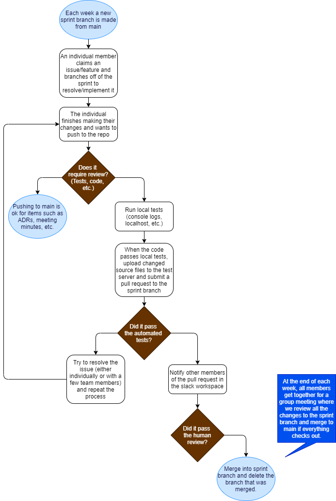

# CI/CD Pipeline
## Current Status
As of 05/25/2021, our CI/CD Pipeline is equipped with an HTML Validator, an automated Jest test suite, and a PR Commenter.

- The HTML Validator scans our HTML files for any syntax errors, such as repeated IDs or missing closing tags.
- The PR test suite runs unit and e2e tests that we've written for our JS files. Since we use Jest-puppeteer in our tests, we maintain a Github Page with updated source files to run our tests on. This page is hosted on another private repository (with all members of this main repository added as collaborators) as we were unable to publish a Github Page using on this repository without making the entire repository public or paying for an upgrade. We will change our approach in the future if we can find a work-around for this.
    - Currently, we have tests set up for creating, migrating, and deleting bullet points.
- The PR Commenter comments on pull requests with modified JS files. It leaves a message reminding the person posting the pull request to update the test server with any modified source files. If they forgot to do this beforehand, they can update the files on the test server and resubmit the pull request. Github Actions will run the tests and save the report on this repository, so when a reviewer checks the pull request they'll be able to verify that the updated files didn't break the project.

Apart from the added workflows, our rules for handling pull requests and pushes to the repository remain largely the same as we planned in phase 1. Each week we will have a branch off of main titled 'firstSprint,' 'secondSprint,' etc. that individual members will branch off of and submit pull requests to in order to implement new, 'smaller' features. At the end of each week we'll review the total changes as a group and push the sprint to main. We may also push the changes sooner if we need to meet upcoming Canvas deadlines. Pull requests from individual members' branches to the sprint branch must be reviewed by at least one other member before they can be merged. They must also pass the automated tests listed above.

## Challenges
We encountered a number of challenges while trying to implement our Jest tests. As mentioned above, as an organization on Github we were unable to publish a Github Page on this repository. To our knowledge, Github Actions also doesn't allow users to open a localhost. We tried running tests by using a file reader and writer on our html files, but this didn't work. 

Rather than have any one member shoulder the burden of constantly maintaining an open test server on their local machine, we decided to publish and maintain a Github Page on a separate repository that all members have access to. Since members are only added as collaborators and not as part of an organization, we have yet to experience any issues with forcing the repository to stay public or paying a fee to maintain our test site.
We'll continue to look for an alternative solution that allows us to keep all of our code centralized in this repository, but for the meantime we found this to be a satisfactory arrangement.

Since we're constantly making changes to the project, we still have to update our tests in the thirdSprint branch. We added some new buttons and changed some class names, so some of the tests are outdated. The tests and source files in main still correspond to one another. We expect to have updated tests for the thirdSprint branch finished by 05/26/2021.

Edit: As of 05/25/2021 at 11:30PM, the tests in thirdSprint match the UI generated by the source files in that branch. 

## Future Plans
In the future we plan to add more unit/e2e tests that will ensure that we have a working Archive and search features. We may also implement a linter and code coverage reporter.

## Updated Pipeline Diagram
The following diagram encapsulates the general process by which modifications are pushed to the main branch (and sprint branches). 

