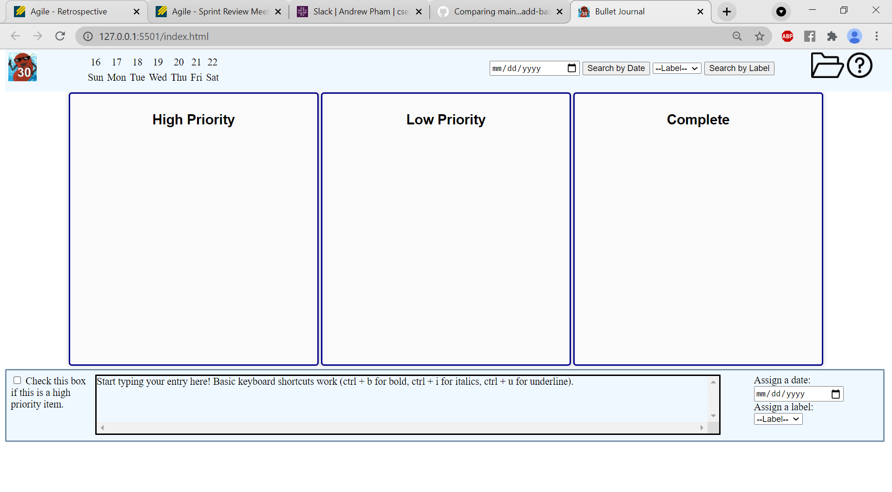
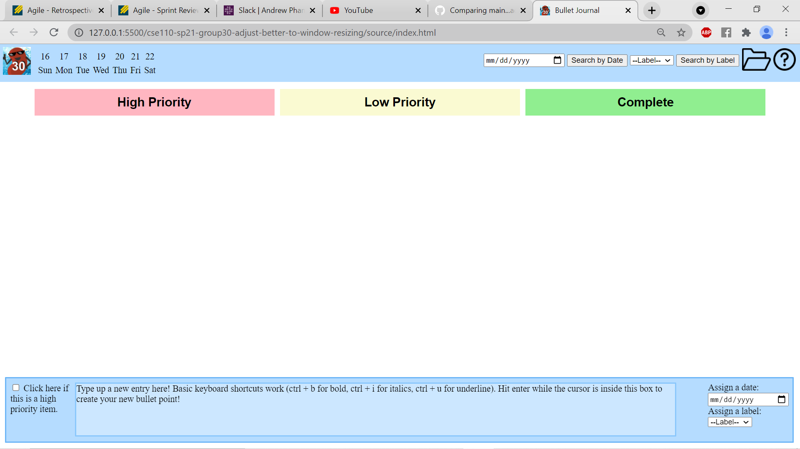
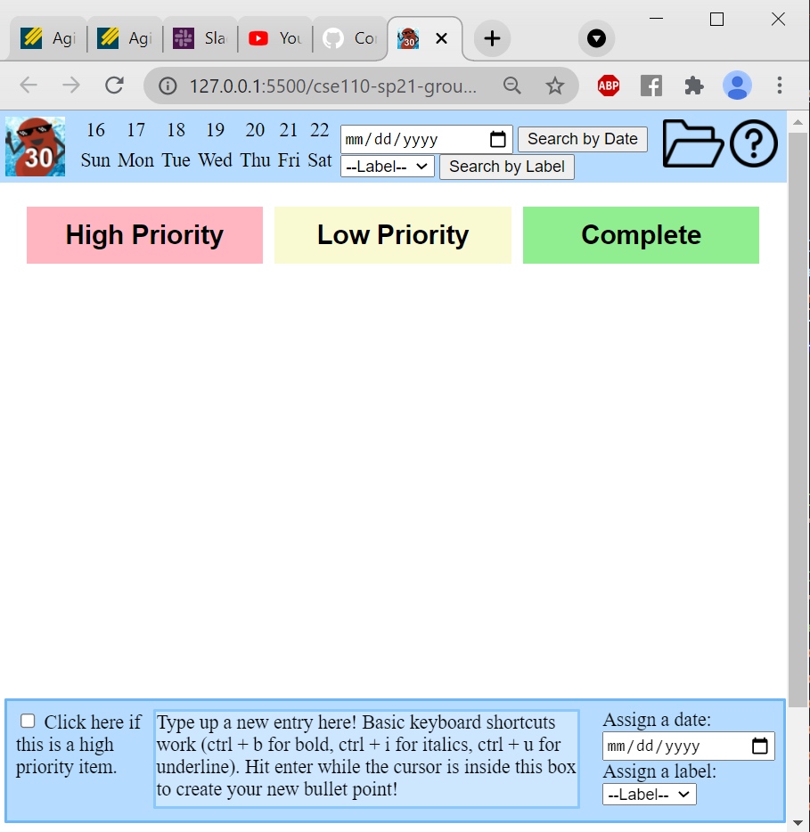

# 05/17/2021 (Sprint 1 Review)
Meeting held over Zoom from 7-7:30PM PST

Team 30 - Cool Beans
## Attendance
Andrew Pham

Angus Yick

Eric Jin

Ikjoon Park

Joe Ikedo

Nataly Buhr

Sonika Ram

Thet Zaw
## Main Points
- We're almost finished pivoting to our new design (some ADRs and pitch documents still need to be updated)
    - Wireframe and use cases have been updated so that we are able to code while catching up the other documents
- We have a skeleton for the project finished
    - Back-end developers have drafted functions for storing BuJo contents in localStorage and handling interactions with UI elements
    - Front-end developers have created a home page that displays dates, has High/Low Priority and Complete sections, and non-functional interactive elements (buttons, checkboxes, etc.)
- A basic workflow and rules for pushes/pull requests have been established

Screenshot of skeleton:

Screenshots of improved skeleton (not finalized before the review, but was brought up during meeting):

