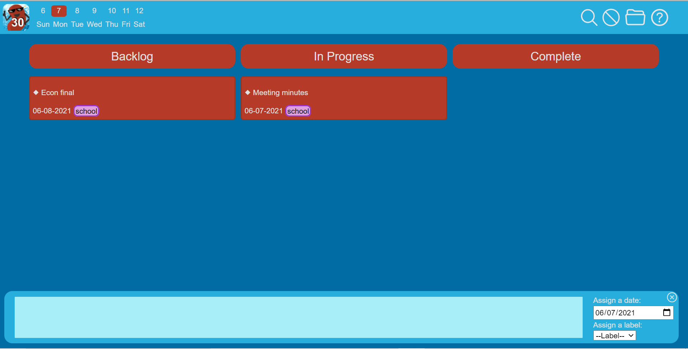
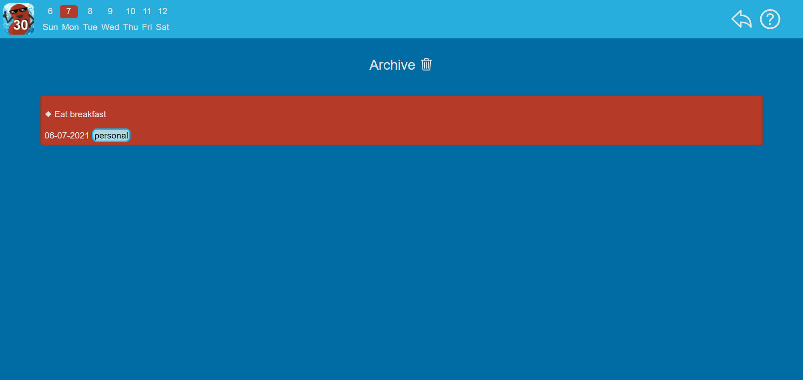

# 06/07/2021 (Sprint 4 Review)
Meeting held over Zoom from 6:30-6:45PM PST

Team 30 - Cool Beans
## Attendance
Andrew Pham

Angus Yick

Eric Jin

Ikjoon Park

Joe Ikedo

Nataly Buhr

Sonika Ram

Thet Zaw
## Side Note
The review and retrospective for sprints 2 and 3 were completed together, which is why there are no separate documents for sprint 3 in the meetings directory.

## Main Points
- We've developed a functional product with all the core features we hoped to implement.
- We've set up more thorough automated unit and e2e tests.
- We've polished the UI by providing multiple color schemes, a unified set of icons, and improving the intuitive design of our application

Screenshots of current state of project:

